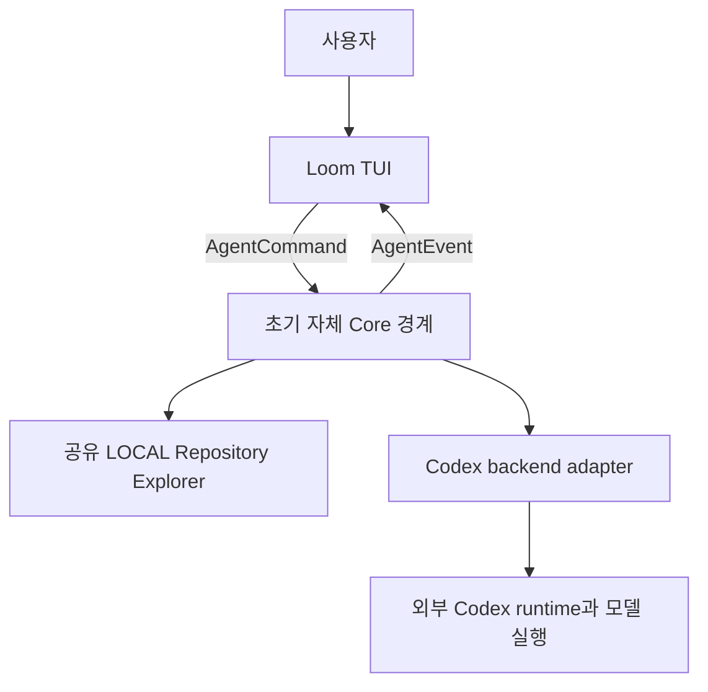

# Loom

**Loom — a coding agent runtime that weaves local compute and multiple model sessions into one coherent workflow.**

로컬 계산과 여러 모델 세션을 하나의 작업 흐름으로 엮는 코딩 에이전트 런타임입니다.

[English](README.md) · [한국어](README.ko.md) · [구현 기획서](docs/orchestrator-implementation-plan.md) · [TUI 완성 계획](docs/tui-completion-plan.md)

[](https://github.com/CREE1116/Loom/actions/workflows/ci.yml)

Loom은 하나의 Orchestrator Core를 중심으로 만드는 코딩 에이전트 CLI입니다. 비용과 능력이 다른 모델 세션과 로컬 계산을 함께 운용하고, 이미 얻은 정보를 재사용하여 API 비용과 작업 시간을 줄이는 것이 목표입니다.

**현재는 초기 구현 단계입니다.** TUI, UI/Core 이벤트 경계, 질문 선택·입력, 활동 projection, 공유 로컬 코드 탐색이 동작합니다. 원격 코딩 실행은 아직 Codex adapter를 사용합니다. 전체 멀티 worker scheduler, durable state, patch 격리, 장기 retrieval, OpenRouter routing은 후속 단계입니다. API 절감률이나 기본 Codex와의 품질 동등성은 아직 benchmark하지 않았습니다.

## Loom을 만드는 이유

모델 대화는 계산을 이어가는 데 유용하지만, 저장소의 사실과 채택된 판단, 실행 상태의 유일한 기록이 되어서는 안 됩니다. 여러 세션에 같은 로그를 넣고 같은 코드를 반복 조사하면 불필요한 비용과 시간이 듭니다.

Loom은 이 책임을 Core로 옮깁니다.

- **에이전트는 하나, 계산 자원은 여러 개입니다.** LOCAL / SMALL / MEDIUM / FLAGSHIP은 Core 아래의 worker입니다. 강한 모델이라고 해서 patch 적용이나 다른 worker 통제 권한을 얻지 않습니다.
- **한 번 탐색한 증거를 공유합니다.** worker들이 각자 같은 코드를 다시 읽는 대신, source reference와 revision 검증을 갖춘 하나의 저장소 자원을 사용합니다.
- **대화·상태·기억을 분리합니다.** worker history는 계산 과정입니다. Canonical State는 현재 사실, Shared Memory는 재사용할 지식, Archive는 원문을 보관합니다.
- **비싼 context에는 필요한 정보만 넣습니다.** Task에 필요한 증거를 구성하고 안정적인 session prefix를 유지하며, 긴 원문 출력은 반복적인 원격 입력 밖에 둡니다.
- **실행 통제는 중앙에 둡니다.** 계획·dependency·취소·retry·escalation·patch 채택은 Core가 맡습니다. 모델은 계산 결과와 recommendation을 반환합니다.

**Core는 세계를 기억하고, Worker는 문제를 풉니다.**

성공 기준은 작업 품질을 유지하면서 API 비용, 전체 작업 시간, uncached remote input, 중복 작업을 줄이는 것입니다. 토큰 수만 줄었다고 성공으로 판단하지 않습니다.

## 현재 사용할 수 있는 기능

| 영역 | 이번 구현에서 제공하는 기능 |
| --- | --- |
| TUI | 대화 구분선, Markdown 제목·강조·목록·링크·표·코드, Unicode 편집, 붙여넣기, 키보드·마우스, 반응형 패널 |
| UI/Core 경계 | typed `AgentEvent` / `AgentCommand`; provider JSON과 승인 payload는 backend adapter가 처리 |
| 질문 | 명시적 선택지, 설명, 직접 입력, 여러 질문, 민감한 입력 마스킹, 숨기기·다시 열기, 검증, 중복 제출 방지 |
| 작업 표시 | 스피너와 상태별 문구 32개; 추론·출력·탐색·테스트·수정·도구 실행을 구분하고 입력 대기·완료에는 정지 |
| 세션 | Codex 기반 목록·전환·새 대화·분기·작업 폴더의 최근 대화 복원 |
| 작업 조작 | 메시지 대기열, 중단, 우선 실행, 권한·신뢰 설정, 도구 출력 페이지, 보고된 diff 검토 |
| Activity 관찰 | typed Task·worker·상태 projection, 대기 이유, Core가 지정한 critical 표시, 작업 상세; 실제 LOCAL 이벤트와 Mock TaskGraph |
| 자체 LOCAL 실행 | `/explore QUERY`와 오프라인 `--explore QUERY`; Core 인스턴스 안에서 저장소 index와 query cache 공유 |
| 모델·운영 표시 | 모델이 제공한 effort 선택, 지시별 설정 보존, 실제 보고된 토큰·cached input·할당량, 명시적 제한 시 대기열 정지 |
| 검증 | 로컬 protocol fixture, Rust 회귀 테스트, 실제 PTY 조작 테스트, 모델 호출 없는 실제 runtime probe |

Activity 패널은 자체 Task projection과 과도기 Codex 활동을 함께 표시합니다. LOCAL 탐색에는 실제 상태·시간·evidence reference를 연결했습니다. Mock TaskGraph로 dependency와 Core가 지정한 critical 표시를 확인할 수 있으며, 실제 멀티 worker scheduling·선택 이유·비용 profiler는 후속 작업입니다. 평소 사용에 패널을 열 필요는 없습니다.

### 같은 코드를 반복 탐색하지 않는 공유 자원

초기 Repository Explorer는 deterministic 로컬 lexical retrieval입니다. 파일 경로·본문·선언 형태로 증거의 순위를 정합니다. 아직 AST/call graph나 vector embedding을 사용하지 않습니다.

- 실행 중인 소비자는 동일한 불변 snapshot을 유지할 수 있습니다.
- revision·검색어·출력 예산이 같은 요청은 계산과 결과를 공유합니다.
- 증거에는 파일 경로·줄 번호·source digest·`repo://` reference가 포함됩니다. live repository에 cached 증거를 반환하기 전에 원문 hash를 확인합니다.
- 기본 출력은 약 4,096자로 제한합니다. 결과가 잘렸다면 검색어를 구체화할 수 있습니다.
- 최대 네 LOCAL 탐색 job을 동시에 실행합니다. 네 동시 소비자가 index build와 검색 계산을 각각 한 번만 수행하는지 회귀 테스트합니다. **실제 원격 모델 네 개를 연결했다는 뜻은 아닙니다.**
- snapshot당 원문 64MiB까지 메모리에 유지하고 초과분은 snapshot이 소유하는 임시 아카이브로 옮깁니다. 메모리 예산이 찼다는 이유로 적합한 파일을 탐색 대상에서 빼지 않습니다.

파일당 512KiB를 넘는 파일, 바이너리, 유효하지 않은 UTF-8 파일은 제외합니다. `.git`, `.custom-tui`, `target`, `node_modules` 경로도 제외합니다. 제외·출력 절단 여부를 표시합니다. cache는 현재 프로세스 안에서만 유지하며, 세션을 넘어가는 durable memory는 아직 아닙니다.

## 빠르게 실행하기

### 준비물

- stable Rust toolchain과 Cargo, Git, ripgrep(`rg`).
- UTF-8과 일반적인 ANSI 터미널 조작을 지원하는 터미널.
- **원격 코딩을 사용할 때만** 설치·인증된 Codex CLI가 필요합니다. `codex-cli 0.151.0`과 `0.159.3`의 protocol을 대상으로 adapter를 검증하며 모든 버전의 호환성을 가정하지 않습니다.

데모와 오프라인 탐색에는 Codex나 API 인증 정보가 필요하지 않습니다. macOS에서 로컬 검증했으며 CI는 macOS·Linux·Windows 대상으로 구성했습니다. 별도 창 실행은 macOS Terminal.app과 Windows 콘솔을 대상으로 합니다. Linux 클립보드 연동에는 `xclip`, macOS에서는 `pbcopy`/`pbpaste`를 사용합니다. Windows 실행 파일 탐색·npm shim 처리·PowerShell/CMD 시작·클립보드·별도 콘솔 경로를 추가했습니다. Windows CI에서 빌드와 모델 호출 없는 runtime 검증을 수행하며 실제 대화형 콘솔 조작은 추가 검증 대상입니다.

```sh
git clone https://github.com/CREE1116/Loom.git
cd Loom

# 모델 추론·코딩 도구 실행 없이 TUI 체험.
./scripts/loom --demo

# 자체 LOCAL 계산만으로 프로젝트 코드 탐색.
./scripts/loom --cwd /path/to/project --explore refresh_session

# 과도기 Codex adapter로 대화형 코딩 시작.
./scripts/loom --cwd /path/to/project
```

첫 실행에는 release 바이너리를 컴파일하므로 시간이 더 걸립니다. 개발 중 빠르게 재빌드하려면:

```sh
CUSTOM_TUI_PROFILE=debug ./scripts/loom --demo
```

내부 crate·바이너리 이름은 현재 `custom-tui`입니다. 프로젝트 진입점은 `scripts/loom`이며 인자를 전달하고 사용자의 작업 폴더를 유지합니다.

### 대화와 모델 지정하기

```sh
# 최근 대화를 복원하는 대신 별도의 새 대화 시작.
./scripts/loom --cwd /path/to/project --new

# 특정 저장된 대화 다시 열기.
./scripts/loom --cwd /path/to/project --resume THREAD_ID

# 모델 호출 없이 설치된 runtime의 지원 모델 확인.
./scripts/loom --list-models

# 지원 목록의 ID로 이번 세션의 모델 지정.
./scripts/loom --cwd /path/to/project --model MODEL_ID

# Codex 실행 파일 경로 지정.
./scripts/loom --cwd /path/to/project --codex-bin /path/to/codex
```

일반 실행은 해당 작업 폴더의 최근 저장된 대화를 찾으면 다시 엽니다. 현재 세션 복원은 Codex history를 사용하며, 자체 Canonical State에서의 복구는 아직 아닙니다. runtime metadata·최근 세션 pointer·UI 설정은 작업 폴더의 `.custom-tui/`에 저장합니다. 기존 Codex 인증을 사용합니다.

### Windows 실행

```powershell
# Rust, Git, ripgrep 설치 후 새 터미널에서 실행합니다.
.\scripts\loom.cmd --demo
.\scripts\loom.cmd --cwd C:\projects\my-app --explore refresh_session

# 원격 코딩에는 별도로 Codex 설치·인증이 필요합니다.
npm.cmd install -g @openai/codex
codex.cmd login
.\scripts\loom.cmd --cwd C:\projects\my-app
```

`.cmd`는 PowerShell 시작 파일에 인수를 전달합니다. `codex`를 찾지 못하면 터미널을 다시 열거나 `--codex-bin`으로 실제 `codex.exe` 또는 npm Codex 진입점을 지정하세요. WSL/Git Bash는 기존 셸 스크립트를 사용할 수 있습니다.

## TUI 사용법

상단 메뉴는 모델 다음에 세션을 둡니다. 명령은 `/`로 검색하며 도움말은 `/help`에 있습니다. `── 사용자 ──`와 `── Loom ──`으로 발화 묶음을 나누고, 같은 응답의 설명·도구·최종 답변은 이어서 표시합니다. 좁은 표는 열별 항목으로 펼칩니다. 복사·분기는 Markdown 원문을 사용합니다.

`/effort high`처럼 runtime이 제공한 선택지만 지정합니다. `/effort default`는 모델 기본값, `/effort runtime`은 현재 runtime 설정을 상속합니다. effort override는 Codex의 후속 턴 설정에도 영향을 줍니다. 대기열 항목은 전송 당시의 model/effort를 보존합니다.

토큰 요약은 입력창 아래, 상세는 `/usage`에 표시합니다. 보고되지 않은 값과 API 비용은 미계측으로 남깁니다. 명시적 할당량 소진·호출 제한 시 원격 전송을 멈추고 지시를 유지합니다. `/usage refresh`로 가능 여부를 확인한 뒤 `/queue resume`로 직접 재개합니다.

메인 Loom을 종료하면 실행 중단·구독 해제를 요청하고 직접 띄운 runtime의 프로세스 트리를 종료합니다. 저장된 기록은 유지하며 다음 실행에서 새 연결로 복원합니다. 열람용 창은 메인 작업을 중단하지 않습니다. 외부 `--endpoint` 서버는 종료하지 않습니다. 한 폴더의 관리형 메인 창은 하나입니다.

메인 화면은 대화와 하단 고정 입력창입니다. 넓은 터미널에서는 Activity·상세 패널을 옆에 열고, 좁은 터미널에서는 별도 상세 화면을 사용합니다. 상세를 열어도 초안과 읽던 위치가 유지됩니다.

| 동작 | 키보드 또는 명령 |
| --- | --- |
| 메시지 전송 | Enter; 응답 중이면 대기열에 추가 |
| 줄바꿈 | Alt+Enter 또는 여러 줄 붙여넣기 |
| 버튼 탐색·선택 | Tab / Shift+Tab 후 Enter; 클릭도 지원 |
| 입력창 복귀·상세 닫기 | Esc |
| 스크롤 | PageUp / PageDown 또는 마우스 휠 |
| 실행 중단 | Ctrl+C; 이미 실행된 파일 변경·도구 효과를 되돌리지 않음 |
| 현재 UI 연결 닫기 | Ctrl+Q; 별도 runtime을 종료하지 않음 |
| 복사·붙여넣기 | 메시지 복사 버튼, Ctrl+Shift+C, Ctrl+V 또는 터미널 붙여넣기 |
| 로컬 코드 증거 탐색 | `/explore QUERY` |
| 숨긴 질문 다시 열기 | `/questions` 또는 질문 알림 |
| 세션·새 대화 | `/sessions`, `/new` |
| 활동·작업 상세 | `/agents`, `/task N` |
| 보고된 변경·도구 출력 | `/diff`, `/tool N` |
| 승인·권한 정책 | `/approvals`, `/permissions` |
| 대기열 조작 | `/queue drop N`, `/queue force N`, `/queue resume`, `/queue clear` |
| 모델·스킬·설정 | `/model`, `/skills`, `/settings` |
| UI 언어 | `/settings english` 또는 `/settings korean` |

### 질문은 사용자가 명시적으로 답합니다

질문 카드는 대화 입력창과 별개의 초안을 가집니다. ↑/↓와 Enter로 선택지를 확인하거나, 허용된 질문에 직접 입력·붙여넣기합니다. Tab/Shift+Tab으로 질문을 이동하고 모든 질문에 답한 뒤 제출합니다.

기본 선택지가 강조되어 있어도 **제출된 답변은 아닙니다.** Esc·나중에로 숨겨도 질문에 답하지 않으며 `/questions`로 다시 엽니다. 전송 실패 시 답변을 유지하여 재시도할 수 있습니다. 민감한 입력은 화면에서 마스킹합니다. blocking 질문은 작업 애니메이션을 멈추고, nonblocking 질문은 실행을 계속 표시합니다. 타이머로 기본값을 자동 제출하지 않습니다.

모델 없이 체험하려면 `--demo`에서 예시 승인을 처리한 뒤 **`질문 데모`**를 전송합니다. 이 trigger는 UI를 영어로 설정해도 현재 한국어이며, 일부 질문·활동·화면 문구의 전체 번역은 후속 작업입니다.

활동 fixture는 예시 승인을 처리한 뒤 **`활동 데모`**를 보내고 `/agents` 또는 `/task 4`로 확인합니다. worker label·dependency 대기·취소를 보여주며 실제 원격 worker 모델을 실행하지 않습니다.

명령의 세부 형태·세션 규칙·runtime 동작은 [TUI 상세 사용 가이드](custom-tui/README.md)에 있습니다.

## 아키텍처와 구현 경계

현재 실행 경로:



자체 Core는 현재 공유 탐색과 LOCAL job을 소유합니다. 원격 코딩 loop는 아직 Codex가 소유합니다. UI를 다시 만들지 않고 이 loop를 단계적으로 교체할 수 있도록 경계를 먼저 분리했습니다.

| 모듈 | 책임 |
| --- | --- |
| `custom-tui/src/agent.rs` | typed UI/Core command·event·projection·질문 계약 |
| `custom-tui/src/app/` | 이벤트 반영·질문 form 상태·Task/Activity 관찰 |
| `custom-tui/src/app.rs` | 대화 상태·입력·동작·화면 구성 |
| `custom-tui/src/engine.rs` | 문자 셀·Unicode 배치·변경 영역 렌더링·클릭 영역 |
| `custom-tui/src/core/` | 자체 LOCAL 실행·저장소 snapshot·공유 query 결과 |
| `custom-tui/src/backend/codex.rs` / `codec.rs` | Codex protocol·요청 상관관계·승인·질문 응답 |
| `custom-tui/src/backend/mock.rs` | provider 형식을 사용하지 않는 `--demo` fixture |
| `custom-tui/src/runtime.rs` / `transport.rs` | 과도기 runtime 수명 관리·WebSocket 전송 |

최종 Core는 TaskGraph, Canonical State, Context Compiler, Memory Manager, Scheduler, Conflict Resolver, Cost Tracker를 소유합니다. worker의 역할은 다음과 같습니다.

| 자원 | 목표 역할 | 현재 상태 |
| --- | --- | --- |
| LOCAL | 저장소 탐색·filesystem/git/test·deterministic 출력 처리; 선택적 작은 로컬 모델 | 공유 코드 탐색 구현, 나머지 native operation 예정 |
| SMALL | 기계적 수정·단순 테스트/문서·제약이 명확한 코드 생성 | 전용 persistent worker 예정 |
| MEDIUM | 일반 기능 구현·debugging·보통 수준의 설계 판단 | 전용 persistent worker 예정 |
| FLAGSHIP | 복잡한 cross-module reasoning·반복 실패 분석·semantic arbitration 추천 | 전용 persistent worker 예정 |

worker는 서로 직접 통신하거나 최종 merge를 하지 않습니다. 독립 Task는 병렬 실행할 수 있지만 dependency와 patch 채택은 Core가 판단합니다.

## 토큰·비용 효율화

효율 기능은 runtime에 기본으로 넣습니다. 사용자가 작업마다 특별한 스킬을 호출할 필요가 없어야 합니다.

| 방식 | 현재 상태 또는 다음 단계 |
| --- | --- |
| 공유 탐색 | 명시적 LOCAL 검색에 구현; 동일한 동시 검색은 합침 |
| 필요한 증거만 반환 | provenance를 가진 짧은 검색 결과 구현; 원격 모델 context 자동 주입은 아직 미연결 |
| 도구 출력 가상화 | 예정: test/search/git 결과를 구조화하고 전체 로그 대신 raw-output reference 사용 |
| 지속 세션·cache epoch | 예정: stable prefix·append-only 작업 영역·명시적 임계값에서 compaction |
| 자체 retrieval·자동 context 이어가기 | 예정: Finding/Decision/Failure 재사용·hybrid retrieval·revision validity·durable task state 복구 |
| 로컬 코드 관계 | 예정: symbol/import/call의 deterministic parsing, 추출된 사실과 추정 관계 분리 |
| 여러 계층 routing | Task/Worker/State 계약 이후 구현; rules부터 시작하고 학습 routing은 후속 |
| 무료 OpenRouter 자원 | 예정: Core가 catalog·capability·가용성으로 선택, bounded retry·cooldown·명시적 fallback budget 적용 |
| 비용·cache profiler | 예정: 실제 usage·가격 버전·latency·baseline 비교, 없는 측정값은 unknown으로 표시 |

LOCAL cache는 동작하는 기반 기능이며, 원격 토큰 절감률을 측정했다는 뜻은 아닙니다. 네 모델에 같은 요청 broadcast, worker끼리 대화, 매 턴 요약, Caveman식 응답 문체 압축은 기본 설계로 채택하지 않습니다.

## 구현 순서

우선 TUI의 조작과 경계를 완성한 뒤 자체 Core의 책임을 늘립니다.

1. **질문·입력 상호작용:** 구현·테스트 완료. 번역과 사용성은 계속 개선합니다.
2. **Activity 관찰:** 초기 Task projection·대기 이유·Core의 critical 표시·상세를 LOCAL/Mock TaskGraph에 구현했습니다. 전체 scheduler가 준비되면 연결합니다.
3. **오류·세션 복구:** 명시적 reconnect·오류 복구, 미전송 작업 보존, 검토·탐색 경험 개선.
4. **Single Worker Core:** TaskGraph·durable Canonical State·WorkerTask/Result·revision·event bus.
5. **자체 worker 실행:** LOCAL 도구·persistent remote session·독립 Task scheduling.
6. **저장소 변경 관리:** patch 격리·Core merge·충돌 감지·revision invalidation.
7. **공유 지식 자원:** 자체 memory/retrieval·context compilation·routing/escalation.
8. **최적화:** 측정 기반 cache-aware scheduling·무료 자원 routing·로컬 speculative work·trace 확보 후 학습된 판단.

이 단계를 통해 Codex Core와 Runtime을 완전히 교체합니다. 기존 runtime 재사용은 구현 전략이며 영구적인 필수 의존성이 아닙니다.

계약과 완료 기준은 [전체 구현 기획서](docs/orchestrator-implementation-plan.md)와 [TUI 완성 계획](docs/tui-completion-plan.md)에 기록했습니다.

## 개발·검증

저장소 루트에서:

```sh
cargo fmt --manifest-path custom-tui/Cargo.toml -- --check
cargo test --locked --manifest-path custom-tui/Cargo.toml
cargo clippy --locked --manifest-path custom-tui/Cargo.toml --all-targets -- -D warnings
cargo build --locked --manifest-path custom-tui/Cargo.toml
python3 custom-tui/tests/terminal_smoke.py
```

기본 검증은 모델을 호출하지 않습니다. UI 회귀·질문/승인 응답 검증·중복 응답·session scope·네 동시 소비자의 query 재사용·source invalidation·archive overflow·실제 PTY 조작을 확인합니다. 수동 profiling과 desktop 창 테스트는 기본 실행에서 제외합니다.

호환되는 Codex runtime을 설치했다면 모델 호출 없이 연결을 확인할 수 있습니다.

```sh
./scripts/loom --probe
```

선택적 live 테스트는 TUI 가이드에 있습니다. 실제 모델 호출이 발생하므로 의도적으로 실행해야 합니다. CI는 기본 검증을 macOS·Linux에서 실행합니다.

## 현재 한계

- 원격 코딩 loop·인증·원격 대화 기록은 아직 Codex에 의존합니다.
- 자동 reconnect·자체 durable state·그 상태에서 자동 context 복구는 미구현입니다.
- 저장소 탐색은 프로세스 내부 lexical retrieval입니다. AST graph·장기 RAG·자동 context 배포는 예정입니다.
- patch 격리와 Core의 충돌 해결은 미구현이며, 현재 원격 파일 변경은 Codex runtime의 동작을 따릅니다.
- 전용 SMALL/MEDIUM/FLAGSHIP worker와 무료 OpenRouter routing은 미연결입니다.
- 질문 UI 전체 번역·더 풍부한 입력 form·통합 로그인·파일 reference 선택은 후속 작업입니다. 지원하지 않는 runtime 요청은 표시하고 거절합니다.
- 별도 Terminal.app 창 생성은 명시적 desktop 검증이 필요합니다. 기본 테스트 통과만으로 OS 창 연동을 검증한 것은 아닙니다.

## 라이선스와 출발점

[Apache-2.0](LICENSE). 개발은 OpenAI Codex checkout에서 시작했습니다. 이 저장소는 upstream monorepo 전체가 아니라 독립적으로 만든 TUI와 초기 Core를 담고 있습니다. OpenAI attribution과 원래 upstream notice를 [NOTICE](NOTICE)와 [licenses/CODEX-NOTICE](licenses/CODEX-NOTICE)에 보존했습니다.

Codex 실행 파일은 별도로 설치하며 함께 배포하지 않습니다. Loom은 OpenAI와 제휴한 프로젝트가 아닙니다.
