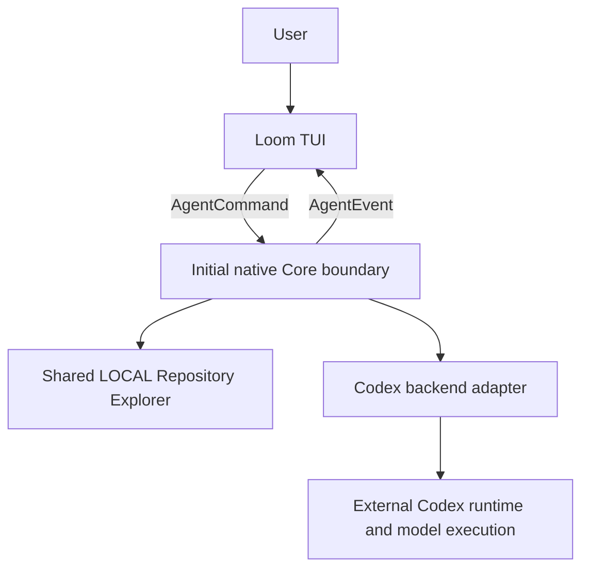

# Loom

**Loom — a coding agent runtime that weaves local compute and multiple model sessions into one coherent workflow.**

[English](README.md) · [한국어](README.ko.md) · [Implementation plan](docs/orchestrator-implementation-plan.md) · [TUI checklist](docs/tui-completion-plan.md)

[](https://github.com/CREE1116/Loom/actions/workflows/ci.yml)

Loom is a coding agent CLI built around one Orchestrator Core. Its goal is to combine local computation and model sessions of different costs and capabilities, reuse what has already been learned, and finish coding tasks with less API spend and waiting time.

**Status: early implementation.** The terminal UI, typed UI/Core boundary, question forms, activity projections and shared local repository explorer are working. Remote coding currently uses a Codex adapter. The full multi-worker scheduler, durable state, patch isolation, long-term retrieval and OpenRouter routing are still planned. API savings and quality parity have not yet been benchmarked.

## Why Loom

A model conversation is useful for computation, but it should not be the sole record of repository facts, accepted decisions and execution state. Sending the same logs and repeating the same repository exploration across model sessions creates avoidable work.

Loom's target architecture puts those responsibilities in the Core:

- **One agent, multiple compute resources.** LOCAL, SMALL, MEDIUM and FLAGSHIP work under the Core. A more capable model gains no additional authority to apply patches or control other workers.
- **Explore once, share evidence.** Workers use a shared repository resource with source references and revision checks, rather than independently rediscovering the same code.
- **Separate conversation, state and memory.** A worker's history supports its current calculation. Canonical State records current facts; Shared Memory holds reusable knowledge; the Archive keeps original material.
- **Keep expensive context focused.** Compile the evidence needed for a task, preserve stable session prefixes and retain raw outputs outside repeated remote input.
- **Keep control central.** Planning, dependencies, cancellation, retries, escalation and patch acceptance belong to the Core. Models return results and recommendations.

**Core remembers the world; workers solve problems.**

The success criterion is maintained task quality with lower API cost, wall-clock time, uncached remote input and redundant work. Fewer tokens alone do not establish success.

## What works today

| Area | Available in this milestone |
| --- | --- |
| Terminal UI | Streaming conversation, Unicode editing, multiline paste, keyboard/mouse navigation, responsive panels, resizing and terminal restoration |
| UI/Core boundary | Typed `AgentEvent` and `AgentCommand`; provider JSON and approval payloads stay in backend adapters |
| Questions | Explicit options, descriptions, custom text, multiple questions, masked secret input, hide/reopen, validation and duplicate-submission protection |
| Execution feedback | A spinner and 32 phrases selected by observed reasoning, output, exploration, tests, patches and tools; paused for blocking input and completion |
| Session controls | Codex-backed session listing, switching, new conversations, forking and reopening a workspace's recent conversation |
| Task interaction | Message queue, interruption, queue promotion, permission/trust controls, tool-output pages and reported diff review |
| Activity inspector | Typed task/worker/status projections, waiting reasons, Core-provided critical markers and task details; real LOCAL events plus a Mock TaskGraph |
| Native LOCAL work | Interactive `/explore QUERY` and offline `--explore QUERY`, sharing one repository index and query cache within a Core instance |
| Model and usage controls | Runtime-advertised effort choices, per-message model/effort snapshots, reported tokens/cached input/quota, queue stop on explicit limits |
| Verification | Local protocol fixtures, Rust regression tests, PTY interaction tests and a real-runtime probe without inference |

The Activity panel displays native task projections alongside transitional Codex activities. LOCAL exploration provides real status, elapsed time and evidence references. A Mock TaskGraph exercises dependencies and Core-provided critical markers; real multi-worker scheduling, routing explanations and a cost profiler remain planned. The panel remains optional for normal use.

### Shared exploration, without duplicate searches

The initial Repository Explorer is deterministic local lexical retrieval. It ranks evidence using paths, source text and declaration-like lines. It does not yet build an AST/call graph or use vector embeddings.

- Running consumers can pin the same immutable snapshot.
- Identical queries for the same revision and output budget share a single computation and result.
- Returned evidence includes a path, line, source digest and `repo://` reference. Source hashes are checked before cached evidence is returned against the live repository.
- Default evidence output is bounded to roughly 4,096 characters. A narrower query can refine truncated output.
- Up to four LOCAL exploration jobs can run concurrently. A regression test confirms four concurrent consumers share one index build and one query computation. **This does not mean four remote models are already connected.**
- Up to 64 MiB of source text stays hot per snapshot. Overflow moves into temporary archives owned by the snapshot, so eligible files are not dropped when that budget fills.

Individual files above 512 KiB and binary/invalid UTF-8 files are excluded. `.git`, `.custom-tui`, `target` and `node_modules` paths are excluded. Omitted files and truncated results are reported. Query caching is currently in-process; it is not durable cross-session memory.

## Quick start

### Requirements

- A stable Rust toolchain with Cargo, plus Git and ripgrep (`rg`).
- A terminal supporting UTF-8 and normal ANSI terminal interaction.
- For **remote coding only**, an installed and authenticated Codex CLI. The adapter has been checked against `codex-cli 0.151.0` and `0.159.3` protocols; compatibility with every release is not assumed.

Demo mode and offline exploration do not require Codex or API credentials. macOS is locally verified; CI is configured for macOS, Linux and Windows. Separate-window launching targets macOS Terminal.app and Windows consoles. Linux clipboard integration requires `xclip`; macOS uses `pbcopy`/`pbpaste`. Windows launcher, npm shim discovery, clipboard and separate-console paths are implemented. Windows CI checks compilation and a runtime probe without inference; interactive Windows console behavior remains an additional validation target.

```sh
git clone https://github.com/CREE1116/Loom.git
cd Loom

# Try the terminal UI without model inference or coding-tool execution.
./scripts/loom --demo

# Search a project using native LOCAL computation only.
./scripts/loom --cwd /path/to/project --explore refresh_session

# Start interactive coding through the transitional Codex adapter.
./scripts/loom --cwd /path/to/project
```

The first launch compiles the release binary, so it takes longer than subsequent launches. For faster development builds:

```sh
CUSTOM_TUI_PROFILE=debug ./scripts/loom --demo
```

The internal crate/binary is currently named `custom-tui`; `scripts/loom` is the project entry point. It forwards arguments and preserves your working directory.

### Pick a conversation or model

```sh
# Start a separate conversation rather than reopening the recent one.
./scripts/loom --cwd /path/to/project --new

# Reopen a specific saved conversation.
./scripts/loom --cwd /path/to/project --resume THREAD_ID

# Inspect the models exposed by your installed runtime, without inference.
./scripts/loom --list-models

# Override this session's model using an ID from that list.
./scripts/loom --cwd /path/to/project --model MODEL_ID

# Use an explicit Codex executable.
./scripts/loom --cwd /path/to/project --codex-bin /path/to/codex
```

Normal startup reopens the workspace's recent saved conversation when available. Session restoration currently relies on Codex history; it is not yet recovery from Loom's own Canonical State. Runtime metadata, recent-session pointers and UI preferences live in the workspace's `.custom-tui/` directory. Existing Codex authentication is reused.

### Windows launch

```powershell
# Install Rust, Git and ripgrep, then reopen the terminal.
.\scripts\loom.cmd --demo
.\scripts\loom.cmd --cwd C:\projects\my-app --explore refresh_session

# Remote coding additionally requires Codex installation and authentication.
npm.cmd install -g @openai/codex
codex.cmd login
.\scripts\loom.cmd --cwd C:\projects\my-app
```

The CMD entry forwards arguments to the PowerShell launcher. If Codex is missing, reopen your terminal or use `--codex-bin` with its native executable or npm entry point. WSL/Git Bash can use the shell launcher.

## Using the TUI

Session follows Model in the navigation row. `/` opens command search; `/help` remains available. Labeled dividers separate user turns from Loom responses, while commentary, tools and the final answer stay in the same response group. Markdown headings, emphasis, lists, links, tables and code blocks render within the pane width; narrow tables become stacked records. Copy and branch retain the original source.

`/effort high` selects a runtime-advertised effort. `/effort default` selects the model default; `/effort runtime` inherits the effective runtime setting. Codex effort overrides also affect subsequent turns. Queue entries preserve their selected model and effort.

Token summaries appear below the composer; `/usage` shows reported counters and quota. Unknown metrics and API cost remain unmeasured. Explicit quota exhaustion or rate limits pause remote submission without discarding queued instructions. Refresh with `/usage refresh`, then manually resume with `/queue resume` when available.

Closing the main Loom requests interruption and detaches its session, then stops the runtime process tree it started. Saved history remains available through a fresh connection next launch. Closing a read-only viewer does not interrupt main work. External `--endpoint` servers are not terminated. One managed main window owns each workspace.

The main view is a conversation with an input composer fixed at the bottom. Wide terminals can show an optional Activity/detail panel alongside it; narrow terminals use a separate detail view. Opening details preserves your draft and reading position.

| Action | Keyboard or command |
| --- | --- |
| Send a message | Enter; while a response is running, the message enters the queue |
| Insert a newline | Alt+Enter or multiline paste |
| Navigate controls | Tab / Shift+Tab, then Enter; controls also support clicks |
| Return to the composer or close details | Esc |
| Scroll | PageUp / PageDown or mouse wheel |
| Interrupt execution | Ctrl+C; already completed file/tool effects are not undone |
| Close this UI connection | Ctrl+Q; this does not shut down the separate runtime |
| Copy or paste | Message copy control, Ctrl+Shift+C, Ctrl+V or terminal paste |
| Local evidence search | `/explore QUERY` |
| Reopen a hidden question | `/questions` or the question notification |
| Sessions / new conversation | `/sessions`, `/new` |
| Activity / task details | `/agents`, `/task N` |
| Reported changes / tool output | `/diff`, `/tool N` |
| Approvals / permission policy | `/approvals`, `/permissions` |
| Queue controls | `/queue drop N`, `/queue force N`, `/queue resume`, `/queue clear` |
| Model / skills / settings | `/model`, `/skills`, `/settings` |
| UI language | `/settings english` or `/settings korean` |

### Questions are explicit user input

A question card has its own drafts, separate from the conversation composer. Use ↑/↓ and Enter to confirm an option, or type/paste a custom answer when allowed. Tab/Shift+Tab moves between questions. Submit after answering all questions.

A highlighted default is **not** a submitted answer. Esc or “later” hides the card without answering it; `/questions` reopens it. Failed submissions retain the answers for retry. Secret inputs are masked on screen. Blocking questions pause the working indicator, while nonblocking questions leave execution running. Timers do not automatically submit defaults.

To try this without a model, run `--demo`, resolve the sample approval, then send **`질문 데모`** (“question demo”). The trigger text is currently Korean even when UI language is set to English; some question/activity/interface labels still need full localization.

For the activity fixture, resolve the sample approval and send **`활동 데모`** (“activity demo”), then open `/agents` or `/task 4`. It demonstrates worker labels, dependency waiting and cancellation; it does not launch remote worker models.

The [detailed TUI guide](custom-tui/README.md) is currently in Korean and includes command variants, session rules and runtime behavior.

## Architecture and implementation boundaries

Current execution path:



The native Core currently owns shared exploration and its LOCAL jobs. Codex still owns the remote coding loop. The separation is in place to replace that loop incrementally without rewriting the UI.

| Module | Responsibility |
| --- | --- |
| `custom-tui/src/agent.rs` | Typed UI/Core commands, events, projections and question contracts |
| `custom-tui/src/app/` | Event reduction, question-form state and task/activity inspection |
| `custom-tui/src/app.rs` | Conversation state, input/actions and UI composition |
| `custom-tui/src/engine.rs` | Cells, Unicode layout, incremental painting and hit regions |
| `custom-tui/src/core/` | Native LOCAL execution, repository snapshots and shared query results |
| `custom-tui/src/backend/codex.rs` / `codec.rs` | Codex protocol handling, request correlation, approvals and question responses |
| `custom-tui/src/backend/mock.rs` | Provider-independent UI fixtures for `--demo` |
| `custom-tui/src/runtime.rs` / `transport.rs` | Transitional runtime lifecycle and WebSocket transport |

The target Core will own TaskGraph, Canonical State, Context Compiler, Memory Manager, Scheduler, Conflict Resolver and Cost Tracker. Its workers have different intended roles:

| Resource | Intended role | Implementation status |
| --- | --- | --- |
| LOCAL | Repository search, filesystem/git/test operations and deterministic output processing; optional small local models | Shared repository exploration implemented; other native operations planned |
| SMALL | Mechanical edits, straightforward tests/docs and constrained code generation | Dedicated persistent worker planned |
| MEDIUM | General implementation, debugging and ordinary design reasoning | Dedicated persistent worker planned |
| FLAGSHIP | Hard cross-module reasoning, repeated-failure analysis and semantic arbitration recommendations | Dedicated persistent worker planned |

Workers will not communicate directly or apply final merges. Independent tasks may run in parallel; dependencies and patch acceptance remain Core decisions.

## Token and cost efficiency

Efficiency belongs in the runtime, so users should not need to invoke a special skill for every task.

| Mechanism | Current state or next step |
| --- | --- |
| Shared exploration | Implemented for explicit LOCAL searches; identical concurrent queries are deduplicated |
| Bounded evidence | Implemented as compact, provenance-bearing search output; automatic injection into remote model context is not yet connected |
| Tool-output virtualization | Planned: structured test/search/git results with raw-output references instead of repeatedly inserting full logs |
| Persistent sessions and cache epochs | Planned: stable prefixes, append-only work areas and compaction at explicit thresholds |
| Native retrieval and context continuation | Planned: reusable findings/decisions/failures, hybrid retrieval and revision-aware validity; recovery from durable task state |
| Local code relationships | Planned: deterministic parsing of symbols/imports/calls, with extracted facts separated from inferred relationships |
| Multi-tier routing | Planned after stable Task/Worker/State contracts; rules first, learned routing later |
| Free OpenRouter resources | Planned: Core-managed catalog/capability/availability selection, bounded retries, cooldowns and explicit fallback budgets |
| Cost and cache profiling | Planned: recorded usage, price versions, latency and baseline comparisons; missing measurements remain unknown |

The LOCAL cache is working infrastructure, not proof of a measured reduction in remote tokens. Four-model broadcasting, worker-to-worker conversations, every-turn summaries and Caveman-style response compression are not defaults in this design.

## Roadmap

The immediate priority is a complete TUI with durable interaction boundaries, followed by native Core ownership.

1. **Question/input interaction:** implemented and tested; continue localization and usability refinements.
2. **Activity inspection:** initial task projections, waiting reasons, Core-provided critical markers and details implemented for LOCAL and Mock TaskGraph; connect the full scheduler when available.
3. **Recovery and session experience:** explicit reconnect/error recovery, preserved unsent work and improved review/navigation.
4. **Single Worker Core:** TaskGraph, durable Canonical State, WorkerTask/Result, revision handling and event bus.
5. **Native worker execution:** LOCAL tools, persistent remote sessions and independent-task scheduling.
6. **Repository safety:** isolated patches, Core merge, conflict detection and revision invalidation.
7. **Shared intelligence resources:** native memory/retrieval, context compilation and routing/escalation.
8. **Optimization:** measured cache-aware scheduling, free-resource routing, local speculative work and learned decisions after collecting traces.

Codex Core and Runtime will be fully replaced over these stages. Reusing the existing runtime is an implementation strategy, not a permanent requirement.

The [runtime implementation plan](docs/orchestrator-implementation-plan.md) and [TUI completion checklist](docs/tui-completion-plan.md) contain the contracts and acceptance conditions. These design documents are currently in Korean.

## Development and verification

From the repository root:

```sh
cargo fmt --manifest-path custom-tui/Cargo.toml -- --check
cargo test --locked --manifest-path custom-tui/Cargo.toml
cargo clippy --locked --manifest-path custom-tui/Cargo.toml --all-targets -- -D warnings
cargo build --locked --manifest-path custom-tui/Cargo.toml
python3 custom-tui/tests/terminal_smoke.py
```

The default checks do not call a model. They cover UI regressions, question/approval response validation, duplicate replies, session scoping, four-consumer query reuse, source invalidation, archive overflow and actual PTY interactions. Manual profiling and desktop-window tests are excluded from default execution.

With a compatible installed Codex runtime, check connectivity without inference:

```sh
./scripts/loom --probe
```

Optional live tests are documented in the TUI guide. They make real model calls and should be run intentionally. CI runs the default checks on macOS and Linux.

## Known limitations

- The remote coding loop, authentication and saved remote conversation history still depend on Codex.
- Automatic reconnect, native durable state and automatic continuation from that state are not implemented.
- The repository explorer is lexical and in-process. AST graphs, long-term RAG and automatic context distribution are planned.
- Patch isolation and Core-controlled conflict resolution are not implemented; current remote file effects follow the Codex runtime.
- Dedicated SMALL/MEDIUM/FLAGSHIP workers and free OpenRouter routing are not connected.
- Full question localization, richer input forms, integrated login and file-reference selection remain follow-up work. Unsupported runtime requests are reported and rejected rather than silently accepted.
- Separate Terminal.app window creation needs explicit desktop verification; passing default tests does not establish desktop integration.

## License and origins

[Apache-2.0](LICENSE). Development began in an OpenAI Codex checkout. This repository contains the independently built UI and initial Core rather than the upstream monorepo. OpenAI attribution and the original upstream notice are retained in [NOTICE](NOTICE) and [licenses/CODEX-NOTICE](licenses/CODEX-NOTICE).

The optional Codex executable is installed separately and is not bundled. Loom is not affiliated with OpenAI.
